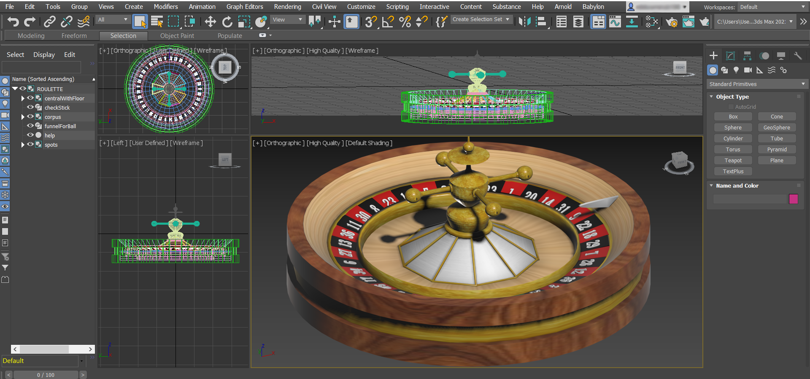
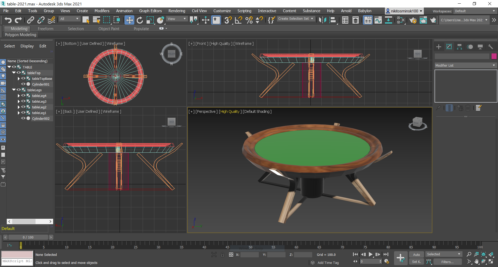

# Casino Roulette "Field of miracles" 🎯🎰

### _Final project made by [Slutski Nikita](https://github.com/user-of-github)_

&nbsp;  
_Welcome to free online roulette !_  
_Make bets, spin the roulette, check your luck and enjoy the process !_

## [LIVE DEMO](http://roulette-course-project.surge.sh/)

&nbsp;

### Technologies stack:

* [Babylon.JS](https://www.babylonjs.com/)
* [React](https://reactjs.org/)
* [TypeScript](https://www.typescriptlang.org/)
* [MobX](https://mobx.js.org/README.html)

### Some game features:

* _6 types of bets_
* _Random-based results_
* _6 types of chips for bets_
* _Real world coefficients_
* _History of roulette results & with animation & random results_
* _Full voice-over of all actions & sound accompaniment — Lots of pleasant voice to enjoy the game !_

### Some development features (UI, code & etc) :

* _Building layout with CSS Grid & CSS FlexBox_
* _Responsive desktop layout (CSS Media Queries)_
* _React animations via [React Transition Group](https://reactcommunity.org/react-transition-group/)_
* _CSS Animations (animation keyframes & transitions)_
* _React CSS Modules_
* _Unified code style_
* _Models completely drawn from scratch by myself (3Ds Max for Roulette, Table & Figma for chips)_
* _Maximum separation into interfaces and types_
* _Maximum separation into React-components_
* _All components are stylistically independent and come with own CSS Modules_

### Software for development:

* [JetBrains WebStorm 2021.1](https://www.jetbrains.com/webstorm/)
* [Autodesk 3Ds Max 2021 / 2022](https://www.autodesk.com/products/3ds-max/overview)
* [Figma](https://www.figma.com/)
* [Microsoft Edge 90.0](https://www.microsoft.com/en-us/edge) and its developer tools

### Some additional auxiliary services used for development:

[Easing functions](https://easings.net/),
[Cubic bezier](https://cubic-bezier.com/),
[Flat Icon](https://www.flaticon.com/),
[Flat UI Colors 2](https://flatuicolors.com/)

### Generalized structure of React components:

### General structure of React components:

### Models in 3Ds Max:

* __Roulette__
  
  &nbsp;
* __Table__
  

&nbsp;
__Important__: Requires GPU for normal rendering of 3D objects & game process in general

&nbsp;

###### Slutski Nikita

###### Copyright &nbsp; © 2021 &nbsp;(June - July)

###### All rights reserved