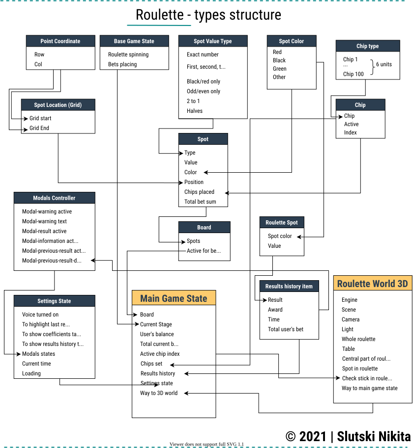
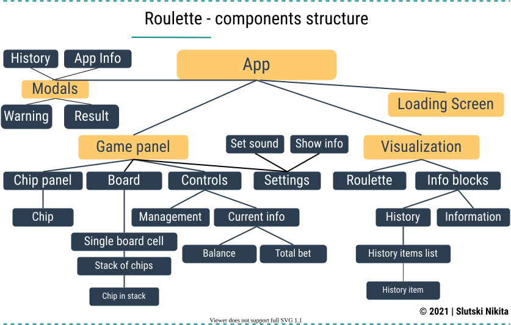
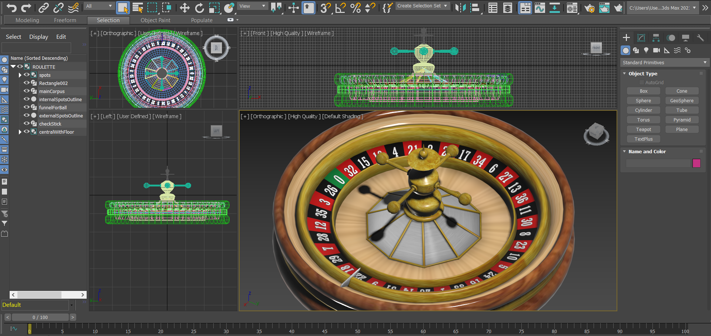
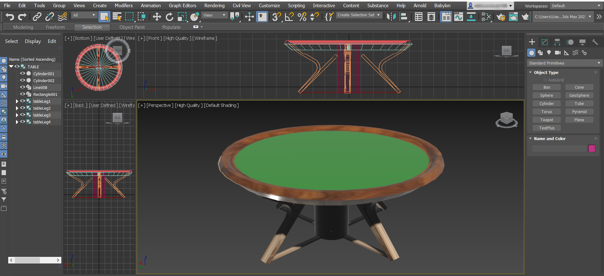

# Casino Roulette "Field of miracles" 🎯🎰

### _Project made by [Slutski Mikita](https://github.com/user-of-github) in 2021_  
___  
### Attention [Comment from 2025 :)]  
__This project was mad during my TypeScript internship at Evolution (Evolution Gaming TypeScript Bootcamp) in 2021. Now, in 2025, after 4 years, I have returned here to update libs' versions, migrate to Vite, restore working capacity for future demo of this my project__   

__What exactly changed__:  
- Migrated from Webpack to Vite 7 
- Updated libs' versions:
  - React version from 17 to 18  
  - TypeScript version from 4 to 5.9  
  - Babylon.js version from 4 to 8  
- Linked React Compiler v1.0
- Modified a bit loading screen (with a manual-start-game button, to force start background music if autoplay didn't work)  
- Fixed a couple of moments, which for some reason stopped working in 2025  
- The rest is not changed and stayed as it was in 2021
___  
&nbsp;  
_Welcome to free online European roulette !_  
_Make bets, spin the roulette, check your luck and enjoy the process !_

## [LIVE DEMO](https://roulette-course-project.netlify.app/)

&nbsp;

### Technologies stack:

* [TypeScript](https://www.typescriptlang.org/)
* [Babylon.JS](https://www.babylonjs.com/)
* [React](https://reactjs.org/)
* [MobX](https://mobx.js.org/README.html)

### Some game features:

* _6 types of bets_
* _Random-based results_
* _6 types of chips for bets_
* _Real world coefficients_
* _History of roulette results & with animation & random results_
* _Full voice-over of all actions & sound accompaniment — Lots of pleasant voice to enjoy the game !_

### Some development features (UI, code & etc) :

* _Building layout with CSS Grid & CSS FlexBox_
* _Responsive desktop layout (CSS Media Queries)_
* _React animations via [React Transition Group](https://reactcommunity.org/react-transition-group/)_
* _CSS Animations (animation keyframes & transitions)_
* _React CSS Modules_
* _Unified code style_
* _Models completely drawn from scratch by myself (3Ds Max for Roulette, Table & Figma for chips)_
* _Maximum separation into interfaces and types_
* _Maximum separation into React-components_
* _All components are stylistically independent and come with own CSS Modules_

### Software for development:

* [JetBrains WebStorm](https://www.jetbrains.com/webstorm/)
* [Autodesk 3Ds Max](https://www.autodesk.com/products/3ds-max/overview)
* [Figma](https://www.figma.com/)
* [Microsoft Edge](https://www.microsoft.com/en-us/edge) and its developer tools

### Some additional auxiliary services used for development & deploy:

[Easing functions](https://easings.net/),
[Cubic bezier](https://cubic-bezier.com/),
[Flat Icon](https://www.flaticon.com/),
[Flat UI Colors](https://flatuicolors.com/),
[Surge](https://surge.sh/)

### Generalized structure of interfaces & classes

### Generalized structure of React components:

### Models in 3Ds Max:

* __Roulette__
  
  &nbsp;
* __Table__
  

&nbsp;
__Important__: 
* Tested on Microsoft Edge (Chronium) browser => Chrome / Edge will be preferable ( __Not Firefox__ 🙃 ) 
* Requires GPU for normal rendering of 3D objects & game process in general

&nbsp;

###### Slutski Mikita

###### Copyright &nbsp; © 2021 &nbsp;(June - July)

###### All rights reserved