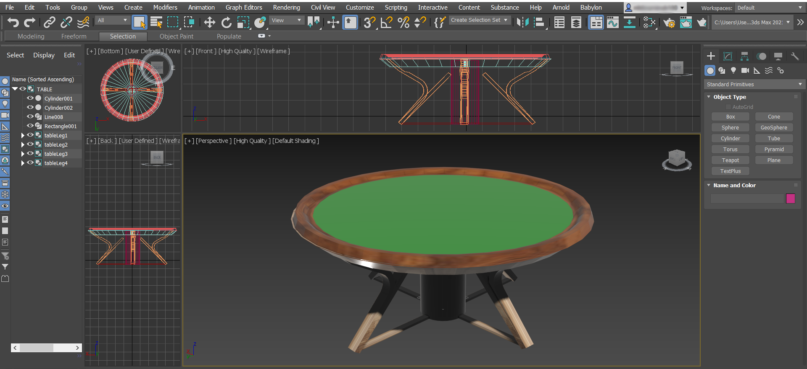

# European Roulette

### _Final project to graduate from [Evolution Gaming TypeScript Bootcamp](https://github.com/evolution-gaming/typescript-bootcamp) made by student [Slutski Nikita](https://github.com/user-of-github)_
&nbsp;  
_Welcome to free online roulette !_  
_Make bets, spin the roulette, check your luck and enjoy the process !_
&nbsp;

#### LIVE DEMO: &nbsp;   [__PLAY__]()
&nbsp;  
#### UI DEMO: 

### Technologies stack:
* [React](https://reactjs.org/)
* [TypeScript](https://www.typescriptlang.org/)
* [MobX](https://mobx.js.org/README.html)
* [Babylon.JS](https://www.babylonjs.com/)  
  
### Software for development: 
* [JetBrains WebStorm 2021.1](https://www.jetbrains.com/webstorm/)
* [Autodesk 3Ds Max 2021/2022](https://www.autodesk.com/products/3ds-max/overview)
* [Microsoft Edge Browser](https://www.microsoft.com/en-us/edge)  

### Some features:
* _Sound accompaniment and voice-over of some actions_  
* _Basic responsiveness of interface_  
* _CSS Animations for better user experience_ 
* _Unified code style_
* _Models are completely drawn from scratch without any help_  

#### Models in 3Ds Max: 
* __Roulette__
  
  &nbsp;
* __Table__
  

&nbsp;

###### Slutski Nikita

###### Copyright &nbsp;© 2021 &nbsp;(June - July)

###### All rights reserved