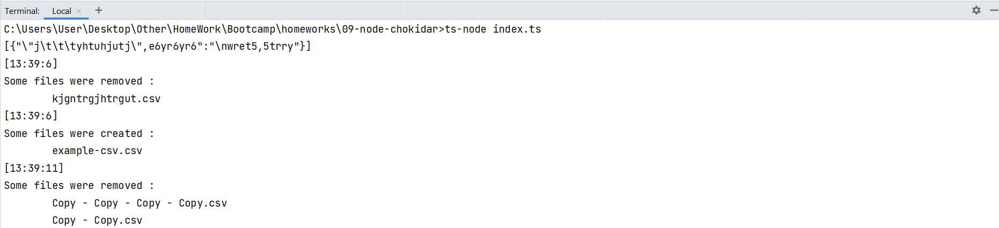

##  9. Chokidar - NodeJS FileSystem & EventEmitter practice  
Demo:  

Technical Specification: [github.com/evolution-gaming/typescript-bootcamp/tree/main/homeworks/09-node-chokidar](https://github.com/evolution-gaming/typescript-bootcamp/tree/main/homeworks/09-node-chokidar)

  
##### Use _ts-node index.ts_ to run application

#### © Slutski Nikita